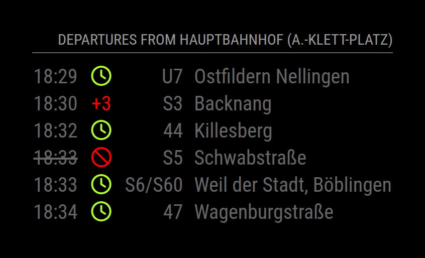

# MMM-vvsDeparture
A MagicMirror2 Module to display information about public transport in Stuttgart, Germany.

The `MMM-vvsDeparture` module is a module designed to display the departures times as stations along the Stuttgart public transportation system.
 It is configurable based on the stations to get destination times for, destinations to exclude and other options.

It also will show any delays, based on the real time information provided by VVS.

The time column shows the planned departure. The column next to it shows the realtime status of each departure:

- `+N` / `-N`: the departure is N minutes late / early. Like VVS, the module counts whole minutes, so a departure 36 seconds late is on time.
- a clock: the departure is on time
- a ban sign, with the departure time struck through: the departure is cancelled
- empty: VVS has no realtime data for the departure

Coupled trains, which VVS lists once for each line, are shown in one row, e.g. `S6/S60` between Stuttgart and Renningen. Departures are combined if they are trains of the same kind, i.e. S-Bahn, regional or long-distance trains, that leave at the same planned time from the same platform and have the same destination or come from the same origin. A train that splits later on shows all its destinations, e.g. `S6/S60 Weil der Stadt, Böblingen`. The row shows the earliest realtime estimate of its parts. If only some parts of a train are cancelled, they get rows of their own. Buses, Stadtbahn trains and trams are never combined, because several of them can leave a stop together to the same destination, e.g. U11 and U19 to NeckarPark (Stadion) on event days.

Example:




## Installation
Run these commands at the root of your magic mirror install.

```shell
cd modules
git clone https://github.com/fhinder/MMM-vvsDeparture
```

## Using the module
To use this module, add the following configuration block to the modules array in the `config/config.js` file:
```js
var config = {
    modules: [
        {
            module: 'MMM-vvsDeparture',
            position: "top_right",
            config: {
                station_id: '<YOUR_STATION_ID_HERE>',
                // See below for more configurable options
            }
        }
    ]
}
```

Note that a `position` setting is not required.

## Configuration options
The following properties can be configured:

<table width="100%">
	<thead>
		<tr>
			<th>Option</th>
			<th width="100%">Description</th>
		</tr>
	<thead>
	<tbody>
		<tr>
			<td><code>station_id</code></td>
			<td>A value which represents the station id of the station. The id is combined of the area prefix <code>de:08111</code> and the unique station id e.g <code>6112</code> which result to <code>de:08111:2201</code>. Here is a full list of all station with 
				corespnding ids within the VVS public transport network, to find your station (<a href="https://www.opendata-oepnv.de/ht/de/organisation/verkehrsverbuende/vvs/startseite">https://www.opendata-oepnv.de/ht/de/organisation/verkehrsverbuende/vvs/startseite</a>).   
				<br><br><b>Possible values:</b> <code>integer</code>
				<br><b>Default value:</b> <code>de:08111:6112</code>
			</td>
		</tr>
		<tr>
			<td><code>station_name</code></td>
			<td>The displayed name for your station.
				<br><br><b>Possible values:</b> <code>string</code>
				<br><b>Default value:</b> <code>undefined</code>
			</td>
		</tr>
		<tr>
			<td><code>maximumEntries</code></td>
      		<td>Number of departure entries which will be shown.
				<br><br><b>Possible values:</b> <code>integer</code>
				<br><b>Default value:</b> <code>6</code>
			</td>
		</tr>
		<tr>
			<td>
			    <code>reloadInterval</code>
			</td>
     		 <td>The refresh rate departure entries will be updated in milliseconds. 
      			<br><br><b>Possible values:</b> <code>integer</code>
				<br><b>Default value:</b> <code>1 * 60 * 1000</code> e.q. one minute
			</td>
		</tr>
		<tr>
			<td>
			    <code>colorDelay</code>
			</td>
     		 <td>Define if the delay value should be colorized.
      			<br><br><b>Possible values:</b> <code>boolean</code>
				<br><b>Default value:</b> <code>true</code>
			</td>
		</tr>
		<tr>
			<td>
			    <code>colorNoDelay</code>
			</td>
     		 <td>Define if the no delay value should be colorized.
      			<br><br><b>Possible values:</b> <code>boolean</code>
				<br><b>Default value:</b> <code>true</code>
			</td>
		</tr>
		<tr>
			<td>
			    <code>number</code>
			</td>
     		 <td>Define the lane number which should be displayed. With this you can hide numbers you don't want to see.
      			<br><br><b>Possible values:</b> <code>String</code> / <code>Array</code> / <code>Function</code> 
				<br><b>Default value:</b> <code>undefined</code>
			</td>
		</tr>
		<tr>
			<td>
			    <code>direction</code>
			</td>
     		 <td>Define the lane direction which should be displayed. With this you can hide numbers you don't wont to see.
      			<br><br><b>Possible values:</b> <code>String</code> / <code>Array</code> / <code>Function</code> 
				<br><b>Default value:</b> <code>undefined</code>
			</td>
		</tr>
		<tr>
			<td>
			    <code>offset</code>
			</td>
     		 <td>Define the offset in minutes. Show connections only starting in the offset minutes.
      			<br><br><b>Possible values:</b> <code>integer</code>
				<br><b>Default value:</b> <code>undefined</code>
			</td>
		</tr>
	</tbody>
</table>

The module loads the next 100 departures of the stop and then filters them. At a busy stop such as Stuttgart Hauptbahnhof, they cover only about half an hour, so with `number` or `direction` the table can show fewer departures than `maximumEntries`.

## Tests

The tests use [node:test](https://nodejs.org/api/test.html) and the development dependencies of the module. Run them in the module directory:

```shell
npm install
npm test
```

